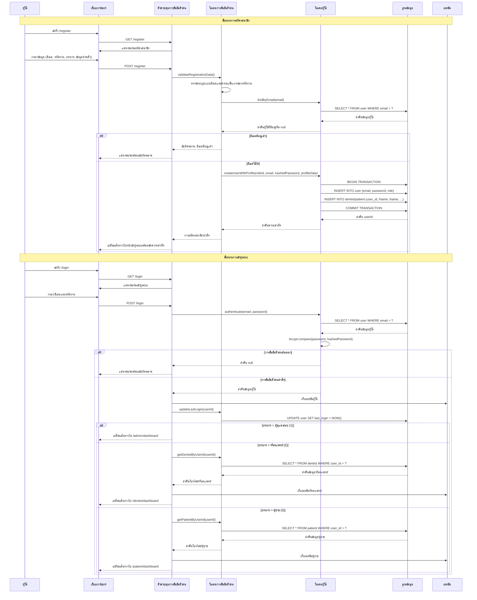

# การยืนยันตัวตนและการสมัครสมาชิก - ระบบจัดการคลินิกทันตกรรม

```mermaid
sequenceDiagram
    participant U as ผู้ใช้
    participant W as เว็บเบราว์เซอร์
    participant A as ตัวควบคุมการยืนยันตัวตน
    participant AM as โมเดลการยืนยันตัวตน
    participant UM as โมเดลผู้ใช้
    participant DB as ฐานข้อมูล
    participant S as เซสชัน

    Note over U,S: ขั้นตอนการสมัครสมาชิก
    U->>W: เข้าถึง /register
    W->>A: GET /register
    A->>W: แสดงฟอร์มสมัครสมาชิก
    U->>W: กรอกข้อมูล (อีเมล, รหัสผ่าน, บทบาท, ข้อมูลส่วนตัว)
    W->>A: POST /register
    A->>AM: validateRegistrationData()
    AM->>AM: ตรวจสอบรูปแบบอีเมลและความแข็งแกร่งของรหัสผ่าน
    AM->>UM: findByEmail(email)
    UM->>DB: SELECT * FROM user WHERE email = ?
    DB-->>UM: ส่งคืนข้อมูลผู้ใช้
    UM-->>AM: ส่งคืนผู้ใช้ที่มีอยู่หรือ null
    alt อีเมลมีอยู่แล้ว
        AM-->>A: ข้อผิดพลาด: อีเมลมีอยู่แล้ว
        A-->>W: แสดงฟอร์มพร้อมข้อผิดพลาด
    else อีเมลใช้ได้
        AM->>UM: createUserWithProfile(roleId, email, hashedPassword, profileData)
        UM->>DB: BEGIN TRANSACTION
        UM->>DB: INSERT INTO user (email, password, role)
        UM->>DB: INSERT INTO dentist/patient (user_id, fname, lname, ...)
        UM->>DB: COMMIT TRANSACTION
        DB-->>UM: ส่งคืน userId
        UM-->>AM: ส่งคืนความสำเร็จ
        AM-->>A: การสมัครสมาชิกสำเร็จ
        A-->>W: เปลี่ยนเส้นทางไปหน้าเข้าสู่ระบบพร้อมข้อความสำเร็จ
    end

    Note over U,S: ขั้นตอนการเข้าสู่ระบบ
    U->>W: เข้าถึง /login
    W->>A: GET /login
    A->>W: แสดงฟอร์มเข้าสู่ระบบ
    U->>W: กรอกอีเมลและรหัสผ่าน
    W->>A: POST /login
    A->>UM: authenticate(email, password)
    UM->>DB: SELECT * FROM user WHERE email = ?
    DB-->>UM: ส่งคืนข้อมูลผู้ใช้
    UM->>UM: bcrypt.compare(password, hashedPassword)
    alt การยืนยันตัวตนล้มเหลว
        UM-->>A: ส่งคืน null
        A-->>W: แสดงฟอร์มพร้อมข้อผิดพลาด
    else การยืนยันตัวตนสำเร็จ
        UM-->>A: ส่งคืนข้อมูลผู้ใช้
        A->>S: เก็บเซสชันผู้ใช้
        A->>AM: updateLastLogin(userId)
        AM->>DB: UPDATE user SET last_login = NOW()
        alt บทบาท = ผู้ดูแลระบบ (1)
            A-->>W: เปลี่ยนเส้นทางไป /admin/dashboard
        else บทบาท = ทันตแพทย์ (2)
            A->>AM: getDentistByUserId(userId)
            AM->>DB: SELECT * FROM dentist WHERE user_id = ?
            DB-->>AM: ส่งคืนข้อมูลทันตแพทย์
            AM-->>A: ส่งคืนโปรไฟล์ทันตแพทย์
            A->>S: เก็บเซสชันทันตแพทย์
            A-->>W: เปลี่ยนเส้นทางไป /dentist/dashboard
        else บทบาท = ผู้ป่วย (3)
            A->>AM: getPatientByUserId(userId)
            AM->>DB: SELECT * FROM patient WHERE user_id = ?
            DB-->>AM: ส่งคืนข้อมูลผู้ป่วย
            AM-->>A: ส่งคืนโปรไฟล์ผู้ป่วย
            A->>S: เก็บเซสชันผู้ป่วย
            A-->>W: เปลี่ยนเส้นทางไป /patient/dashboard
        end
    end
```