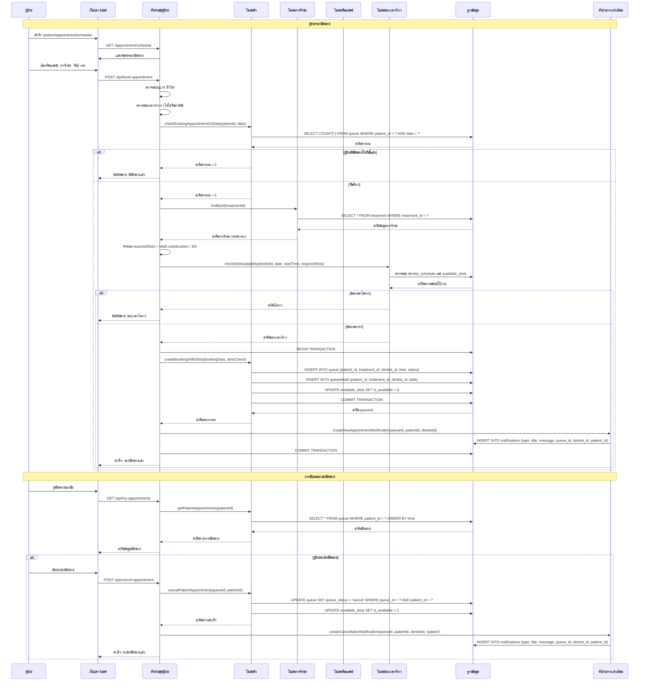

# การจองนัดหมายและการจัดการนัดหมาย - ระบบจัดการคลินิกทันตกรรม

```mermaid
sequenceDiagram
    participant P as ผู้ป่วย
    participant W as เว็บเบราว์เซอร์
    participant PC as ตัวควบคุมผู้ป่วย
    participant QM as โมเดลคิว
    participant TM as โมเดลการรักษา
    participant DM as โมเดลทันตแพทย์
    participant ASM as โมเดลช่องเวลาที่ว่าง
    participant DB as ฐานข้อมูล
    participant NH as ตัวช่วยการแจ้งเตือน

    Note over P,NH: ผู้ป่วยจองนัดหมาย
    P->>W: เข้าถึง /patient/appointment/schedule
    W->>PC: GET /appointment/schedule
    PC->>W: แสดงฟอร์มจองนัดหมาย
    P->>W: เลือกทันตแพทย์, การรักษา, วันที่, เวลา
    W->>PC: POST /api/book-appointment
    PC->>PC: ตรวจสอบกฎ 24 ชั่วโมง
    PC->>PC: ตรวจสอบเวลาทำการ (ไม่ใช่วันอาทิตย์)
    PC->>QM: checkExistingAppointmentOnDate(patientId, date)
    QM->>DB: SELECT COUNT(*) FROM queue WHERE patient_id = ? AND date = ?
    DB-->>QM: ส่งคืนจำนวน
    alt ผู้ป่วยมีนัดหมายในวันนี้แล้ว
        QM-->>PC: ส่งคืนจำนวน > 0
        PC-->>W: ข้อผิดพลาด: มีนัดหมายแล้ว
    else วันที่ว่าง
        QM-->>PC: ส่งคืนจำนวน = 0
        PC->>TM: findById(treatmentId)
        TM->>DB: SELECT * FROM treatment WHERE treatment_id = ?
        DB-->>TM: ส่งคืนข้อมูลการรักษา
        TM-->>PC: ส่งคืนการรักษา (ระยะเวลา)
        PC->>PC: คำนวณ requiredSlots = Math.ceil(duration / 30)
        PC->>ASM: checkSlotAvailability(dentistId, date, startTime, requiredSlots)
        ASM->>DB: ตรวจสอบ dentist_schedule และ available_slots
        DB-->>ASM: ส่งคืนความพร้อมใช้งาน
        alt ช่องเวลาไม่ว่าง
            ASM-->>PC: ส่งคืนไม่ว่าง
            PC-->>W: ข้อผิดพลาด: ช่องเวลาไม่ว่าง
        else ช่องเวลาว่าง
            ASM-->>PC: ส่งคืนช่องเวลาที่ว่าง
            PC->>DB: BEGIN TRANSACTION
            PC->>QM: createBookingWithSlots(bookingData, slotsCheck)
            QM->>DB: INSERT INTO queue (patient_id, treatment_id, dentist_id, time, status)
            QM->>DB: INSERT INTO queuedetail (patient_id, treatment_id, dentist_id, date)
            QM->>DB: UPDATE available_slots SET is_available = 0
            QM->>DB: COMMIT TRANSACTION
            DB-->>QM: ส่งคืน queueId
            QM-->>PC: ส่งคืนผลการจอง
            PC->>NH: createNewAppointmentNotification(queueId, patientId, dentistId)
            NH->>DB: INSERT INTO notifications (type, title, message, queue_id, dentist_id, patient_id)
            PC->>DB: COMMIT TRANSACTION
            PC-->>W: สำเร็จ: จองนัดหมายแล้ว
        end
    end

    Note over P,NH: การอัปเดตสถานะนัดหมาย
    P->>W: ดูนัดหมายของฉัน
    W->>PC: GET /api/my-appointments
    PC->>QM: getPatientAppointments(patientId)
    QM->>DB: SELECT * FROM queue WHERE patient_id = ? ORDER BY time
    DB-->>QM: ส่งคืนนัดหมาย
    QM-->>PC: ส่งคืนรายการนัดหมาย
    PC-->>W: ส่งคืนข้อมูลนัดหมาย

    alt ผู้ป่วยยกเลิกนัดหมาย
        P->>W: คลิกยกเลิกนัดหมาย
        W->>PC: POST /api/cancel-appointment
        PC->>QM: cancelPatientAppointment(queueId, patientId)
        QM->>DB: UPDATE queue SET queue_status = 'cancel' WHERE queue_id = ? AND patient_id = ?
        QM->>DB: UPDATE available_slots SET is_available = 1
        QM-->>PC: ส่งคืนความสำเร็จ
        PC->>NH: createCancellationNotification(queueId, patientId, dentistId, 'patient')
        NH->>DB: INSERT INTO notifications (type, title, message, queue_id, dentist_id, patient_id)
        PC-->>W: สำเร็จ: ยกเลิกนัดหมายแล้ว
    end
```