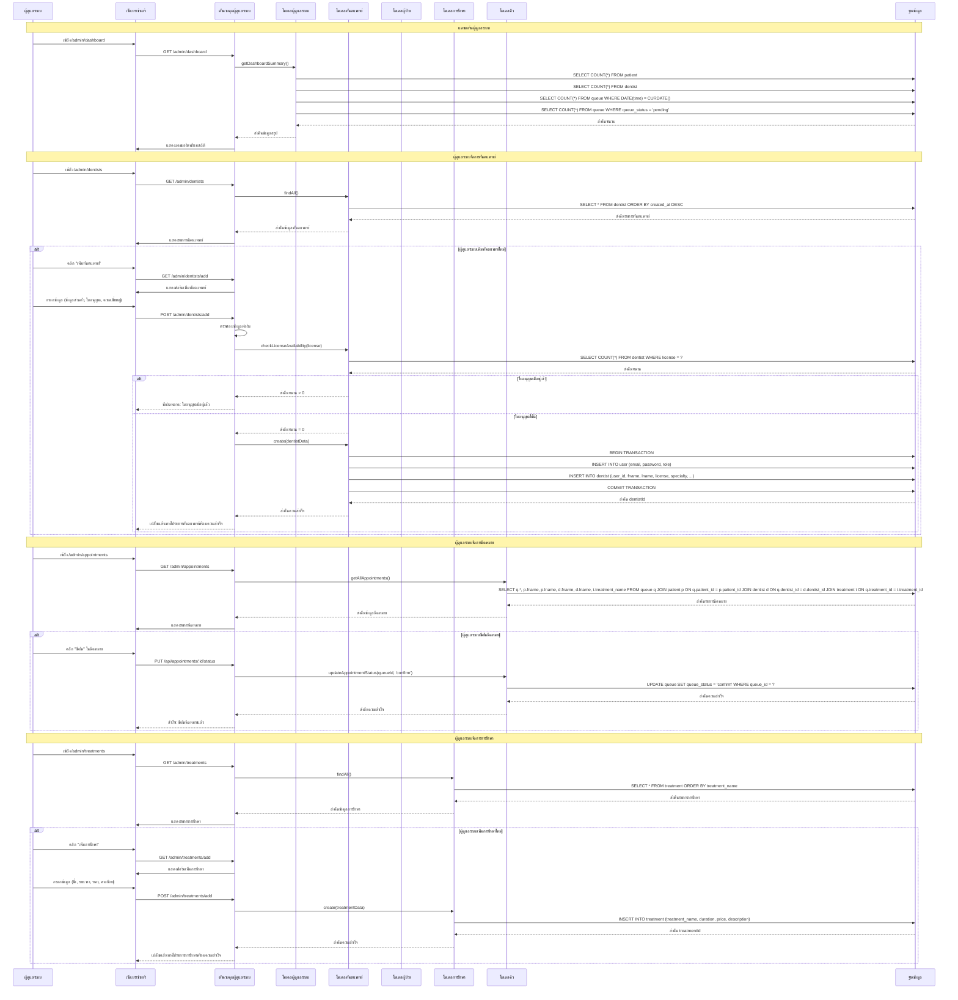

# การจัดการผู้ดูแลระบบ - ระบบจัดการคลินิกทันตกรรม

```mermaid
sequenceDiagram
    participant A as ผู้ดูแลระบบ
    participant W as เว็บเบราว์เซอร์
    participant AC as ตัวควบคุมผู้ดูแลระบบ
    participant AM as โมเดลผู้ดูแลระบบ
    participant DM as โมเดลทันตแพทย์
    participant PM as โมเดลผู้ป่วย
    participant TM as โมเดลการรักษา
    participant QM as โมเดลคิว
    participant DB as ฐานข้อมูล

    Note over A,DB: แดชบอร์ดผู้ดูแลระบบ
    A->>W: เข้าถึง /admin/dashboard
    W->>AC: GET /admin/dashboard
    AC->>AM: getDashboardSummary()
    AM->>DB: SELECT COUNT(*) FROM patient
    AM->>DB: SELECT COUNT(*) FROM dentist
    AM->>DB: SELECT COUNT(*) FROM queue WHERE DATE(time) = CURDATE()
    AM->>DB: SELECT COUNT(*) FROM queue WHERE queue_status = 'pending'
    DB-->>AM: ส่งคืนจำนวน
    AM-->>AC: ส่งคืนข้อมูลสรุป
    AC->>W: แสดงแดชบอร์ดพร้อมสถิติ

    Note over A,DB: ผู้ดูแลระบบจัดการทันตแพทย์
    A->>W: เข้าถึง /admin/dentists
    W->>AC: GET /admin/dentists
    AC->>DM: findAll()
    DM->>DB: SELECT * FROM dentist ORDER BY created_at DESC
    DB-->>DM: ส่งคืนรายการทันตแพทย์
    DM-->>AC: ส่งคืนข้อมูลทันตแพทย์
    AC->>W: แสดงรายการทันตแพทย์

    alt ผู้ดูแลระบบเพิ่มทันตแพทย์ใหม่
        A->>W: คลิก "เพิ่มทันตแพทย์"
        W->>AC: GET /admin/dentists/add
        AC->>W: แสดงฟอร์มเพิ่มทันตแพทย์
        A->>W: กรอกข้อมูล (ข้อมูลส่วนตัว, ใบอนุญาต, ความเชี่ยวชาญ)
        W->>AC: POST /admin/dentists/add
        AC->>AC: ตรวจสอบข้อมูลฟอร์ม
        AC->>DM: checkLicenseAvailability(license)
        DM->>DB: SELECT COUNT(*) FROM dentist WHERE license = ?
        DB-->>DM: ส่งคืนจำนวน
        alt ใบอนุญาตมีอยู่แล้ว
            DM-->>AC: ส่งคืนจำนวน > 0
            AC-->>W: ข้อผิดพลาด: ใบอนุญาตมีอยู่แล้ว
        else ใบอนุญาตใช้ได้
            DM-->>AC: ส่งคืนจำนวน = 0
            AC->>DM: create(dentistData)
            DM->>DB: BEGIN TRANSACTION
            DM->>DB: INSERT INTO user (email, password, role)
            DM->>DB: INSERT INTO dentist (user_id, fname, lname, license, specialty, ...)
            DM->>DB: COMMIT TRANSACTION
            DB-->>DM: ส่งคืน dentistId
            DM-->>AC: ส่งคืนความสำเร็จ
            AC-->>W: เปลี่ยนเส้นทางไปรายการทันตแพทย์พร้อมความสำเร็จ
        end
    end

    Note over A,DB: ผู้ดูแลระบบจัดการนัดหมาย
    A->>W: เข้าถึง /admin/appointments
    W->>AC: GET /admin/appointments
    AC->>QM: getAllAppointments()
    QM->>DB: SELECT q.*, p.fname, p.lname, d.fname, d.lname, t.treatment_name FROM queue q JOIN patient p ON q.patient_id = p.patient_id JOIN dentist d ON q.dentist_id = d.dentist_id JOIN treatment t ON q.treatment_id = t.treatment_id
    DB-->>QM: ส่งคืนรายการนัดหมาย
    QM-->>AC: ส่งคืนข้อมูลนัดหมาย
    AC->>W: แสดงรายการนัดหมาย

    alt ผู้ดูแลระบบยืนยันนัดหมาย
        A->>W: คลิก "ยืนยัน" ในนัดหมาย
        W->>AC: PUT /api/appointments/:id/status
        AC->>QM: updateAppointmentStatus(queueId, 'confirm')
        QM->>DB: UPDATE queue SET queue_status = 'confirm' WHERE queue_id = ?
        DB-->>QM: ส่งคืนความสำเร็จ
        QM-->>AC: ส่งคืนความสำเร็จ
        AC-->>W: สำเร็จ: ยืนยันนัดหมายแล้ว
    end

    Note over A,DB: ผู้ดูแลระบบจัดการการรักษา
    A->>W: เข้าถึง /admin/treatments
    W->>AC: GET /admin/treatments
    AC->>TM: findAll()
    TM->>DB: SELECT * FROM treatment ORDER BY treatment_name
    DB-->>TM: ส่งคืนรายการการรักษา
    TM-->>AC: ส่งคืนข้อมูลการรักษา
    AC->>W: แสดงรายการการรักษา

    alt ผู้ดูแลระบบเพิ่มการรักษาใหม่
        A->>W: คลิก "เพิ่มการรักษา"
        W->>AC: GET /admin/treatments/add
        AC->>W: แสดงฟอร์มเพิ่มการรักษา
        A->>W: กรอกข้อมูล (ชื่อ, ระยะเวลา, ราคา, คำอธิบาย)
        W->>AC: POST /admin/treatments/add
        AC->>TM: create(treatmentData)
        TM->>DB: INSERT INTO treatment (treatment_name, duration, price, description)
        DB-->>TM: ส่งคืน treatmentId
        TM-->>AC: ส่งคืนความสำเร็จ
        AC-->>W: เปลี่ยนเส้นทางไปรายการการรักษาพร้อมความสำเร็จ
    end
```