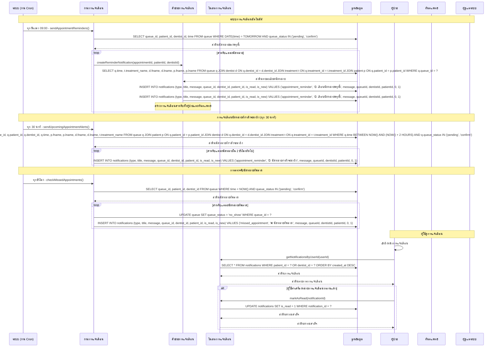

# ระบบการแจ้งเตือน - ระบบจัดการคลินิกทันตกรรม

```mermaid
sequenceDiagram
    participant S as ระบบ (งาน Cron)
    participant NJ as งานการแจ้งเตือน
    participant NH as ตัวช่วยการแจ้งเตือน
    participant NM as โมเดลการแจ้งเตือน
    participant DB as ฐานข้อมูล
    participant P as ผู้ป่วย
    participant D as ทันตแพทย์
    participant A as ผู้ดูแลระบบ

    Note over S,A: ระบบการแจ้งเตือนอัตโนมัติ
    S->>NJ: ทุกวันเวลา 09:00 - sendAppointmentReminders()
    NJ->>DB: SELECT queue_id, patient_id, dentist_id, time FROM queue WHERE DATE(time) = TOMORROW AND queue_status IN ('pending', 'confirm')
    DB-->>NJ: ส่งคืนนัดหมายของพรุ่งนี้
    loop สำหรับแต่ละนัดหมาย
        NJ->>NH: createReminderNotification(appointmentId, patientId, dentistId)
        NH->>DB: SELECT q.time, t.treatment_name, d.fname, d.lname, p.fname, p.lname FROM queue q JOIN dentist d ON q.dentist_id = d.dentist_id JOIN treatment t ON q.treatment_id = t.treatment_id JOIN patient p ON q.patient_id = p.patient_id WHERE q.queue_id = ?
        DB-->>NH: ส่งคืนรายละเอียดนัดหมาย
        NH->>DB: INSERT INTO notifications (type, title, message, queue_id, dentist_id, patient_id, is_read, is_new) VALUES ('appointment_reminder', '⏰ เตือนนัดหมายพรุ่งนี้', message, queueId, dentistId, patientId, 0, 1)
        NH->>DB: INSERT INTO notifications (type, title, message, queue_id, dentist_id, patient_id, is_read, is_new) VALUES ('appointment_reminder', '⏰ เตือนนัดหมายพรุ่งนี้', message, queueId, dentistId, patientId, 0, 1)
        Note over NH: สร้างการแจ้งเตือนสำหรับทั้งผู้ป่วยและทันตแพทย์
    end

    Note over S,A: การแจ้งเตือนนัดหมายที่กำลังจะมาถึง (ทุก 30 นาที)
    S->>NJ: ทุก 30 นาที - sendUpcomingAppointmentAlerts()
    NJ->>DB: SELECT q.queue_id, q.patient_id, q.dentist_id, q.time, p.fname, p.lname, d.fname, d.lname, t.treatment_name FROM queue q JOIN patient p ON q.patient_id = p.patient_id JOIN dentist d ON q.dentist_id = d.dentist_id JOIN treatment t ON q.treatment_id = t.treatment_id WHERE q.time BETWEEN NOW() AND (NOW() + 2 HOURS) AND q.queue_status IN ('pending', 'confirm')
    DB-->>NJ: ส่งคืนนัดหมายที่กำลังจะมาถึง
    loop สำหรับแต่ละนัดหมายใน 2 ชั่วโมงถัดไป
        NJ->>DB: INSERT INTO notifications (type, title, message, queue_id, dentist_id, patient_id, is_read, is_new) VALUES ('appointment_reminder', '⏰ นัดหมายกำลังจะมาถึง', message, queueId, dentistId, patientId, 0, 1)
    end

    Note over S,A: การตรวจจับนัดหมายที่พลาด
    S->>NJ: ทุกชั่วโมง - checkMissedAppointments()
    NJ->>DB: SELECT queue_id, patient_id, dentist_id FROM queue WHERE time < NOW() AND queue_status IN ('pending', 'confirm')
    DB-->>NJ: ส่งคืนนัดหมายที่พลาด
    loop สำหรับแต่ละนัดหมายที่พลาด
        NJ->>DB: UPDATE queue SET queue_status = 'no_show' WHERE queue_id = ?
        NJ->>DB: INSERT INTO notifications (type, title, message, queue_id, dentist_id, patient_id, is_read, is_new) VALUES ('missed_appointment', '❌ นัดหมายที่พลาด', message, queueId, dentistId, patientId, 0, 1)
    end

    Note over P,A: ผู้ใช้ดูการแจ้งเตือน
    P->>P: เข้าถึงหน้าการแจ้งเตือน
    P->>NM: getNotificationsByUserId(userId)
    NM->>DB: SELECT * FROM notifications WHERE patient_id = ? OR dentist_id = ? ORDER BY created_at DESC
    DB-->>NM: ส่งคืนการแจ้งเตือน
    NM-->>P: ส่งคืนรายการการแจ้งเตือน

    alt ผู้ใช้ทำเครื่องหมายการแจ้งเตือนว่าอ่านแล้ว
        P->>NM: markAsRead(notificationId)
        NM->>DB: UPDATE notifications SET is_read = 1 WHERE notification_id = ?
        DB-->>NM: ส่งคืนความสำเร็จ
        NM-->>P: ส่งคืนความสำเร็จ
    end
```