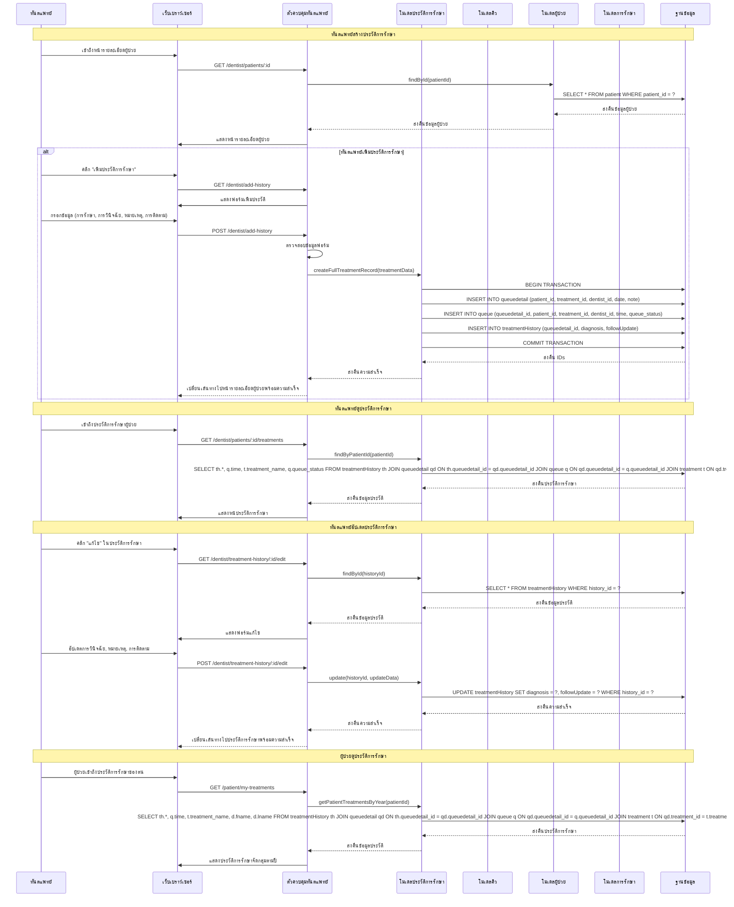

# ประวัติการรักษาและการจัดการ - ระบบจัดการคลินิกทันตกรรม

```mermaid
sequenceDiagram
    participant D as ทันตแพทย์
    participant W as เว็บเบราว์เซอร์
    participant DC as ตัวควบคุมทันตแพทย์
    participant THM as โมเดลประวัติการรักษา
    participant QM as โมเดลคิว
    participant PM as โมเดลผู้ป่วย
    participant TM as โมเดลการรักษา
    participant DB as ฐานข้อมูล

    Note over D,DB: ทันตแพทย์สร้างประวัติการรักษา
    D->>W: เข้าถึงหน้ารายละเอียดผู้ป่วย
    W->>DC: GET /dentist/patients/:id
    DC->>PM: findById(patientId)
    PM->>DB: SELECT * FROM patient WHERE patient_id = ?
    DB-->>PM: ส่งคืนข้อมูลผู้ป่วย
    PM-->>DC: ส่งคืนข้อมูลผู้ป่วย
    DC->>W: แสดงหน้ารายละเอียดผู้ป่วย

    alt ทันตแพทย์เพิ่มประวัติการรักษา
        D->>W: คลิก "เพิ่มประวัติการรักษา"
        W->>DC: GET /dentist/add-history
        DC->>W: แสดงฟอร์มเพิ่มประวัติ
        D->>W: กรอกข้อมูล (การรักษา, การวินิจฉัย, หมายเหตุ, การติดตาม)
        W->>DC: POST /dentist/add-history
        DC->>DC: ตรวจสอบข้อมูลฟอร์ม
        DC->>THM: createFullTreatmentRecord(treatmentData)
        THM->>DB: BEGIN TRANSACTION
        THM->>DB: INSERT INTO queuedetail (patient_id, treatment_id, dentist_id, date, note)
        THM->>DB: INSERT INTO queue (queuedetail_id, patient_id, treatment_id, dentist_id, time, queue_status)
        THM->>DB: INSERT INTO treatmentHistory (queuedetail_id, diagnosis, followUpdate)
        THM->>DB: COMMIT TRANSACTION
        DB-->>THM: ส่งคืน IDs
        THM-->>DC: ส่งคืนความสำเร็จ
        DC-->>W: เปลี่ยนเส้นทางไปหน้ารายละเอียดผู้ป่วยพร้อมความสำเร็จ
    end

    Note over D,DB: ทันตแพทย์ดูประวัติการรักษา
    D->>W: เข้าถึงประวัติการรักษาผู้ป่วย
    W->>DC: GET /dentist/patients/:id/treatments
    DC->>THM: findByPatientId(patientId)
    THM->>DB: SELECT th.*, q.time, t.treatment_name, q.queue_status FROM treatmentHistory th JOIN queuedetail qd ON th.queuedetail_id = qd.queuedetail_id JOIN queue q ON qd.queuedetail_id = q.queuedetail_id JOIN treatment t ON qd.treatment_id = t.treatment_id WHERE qd.patient_id = ? ORDER BY q.time DESC
    DB-->>THM: ส่งคืนประวัติการรักษา
    THM-->>DC: ส่งคืนข้อมูลประวัติ
    DC->>W: แสดงหน้ประวัติการรักษา

    Note over D,DB: ทันตแพทย์อัปเดตประวัติการรักษา
    D->>W: คลิก "แก้ไข" ในประวัติการรักษา
    W->>DC: GET /dentist/treatment-history/:id/edit
    DC->>THM: findById(historyId)
    THM->>DB: SELECT * FROM treatmentHistory WHERE history_id = ?
    DB-->>THM: ส่งคืนข้อมูลประวัติ
    THM-->>DC: ส่งคืนข้อมูลประวัติ
    DC->>W: แสดงฟอร์มแก้ไข
    D->>W: อัปเดตการวินิจฉัย, หมายเหตุ, การติดตาม
    W->>DC: POST /dentist/treatment-history/:id/edit
    DC->>THM: update(historyId, updateData)
    THM->>DB: UPDATE treatmentHistory SET diagnosis = ?, followUpdate = ? WHERE history_id = ?
    DB-->>THM: ส่งคืนความสำเร็จ
    THM-->>DC: ส่งคืนความสำเร็จ
    DC-->>W: เปลี่ยนเส้นทางไปประวัติการรักษาพร้อมความสำเร็จ

    Note over D,DB: ผู้ป่วยดูประวัติการรักษา
    D->>W: ผู้ป่วยเข้าถึงประวัติการรักษาของตน
    W->>DC: GET /patient/my-treatments
    DC->>THM: getPatientTreatmentsByYear(patientId)
    THM->>DB: SELECT th.*, q.time, t.treatment_name, d.fname, d.lname FROM treatmentHistory th JOIN queuedetail qd ON th.queuedetail_id = qd.queuedetail_id JOIN queue q ON qd.queuedetail_id = q.queuedetail_id JOIN treatment t ON qd.treatment_id = t.treatment_id JOIN dentist d ON qd.dentist_id = d.dentist_id WHERE qd.patient_id = ? ORDER BY q.time DESC
    DB-->>THM: ส่งคืนประวัติการรักษา
    THM-->>DC: ส่งคืนข้อมูลประวัติ
    DC->>W: แสดงประวัติการรักษาจัดกลุ่มตามปี
```