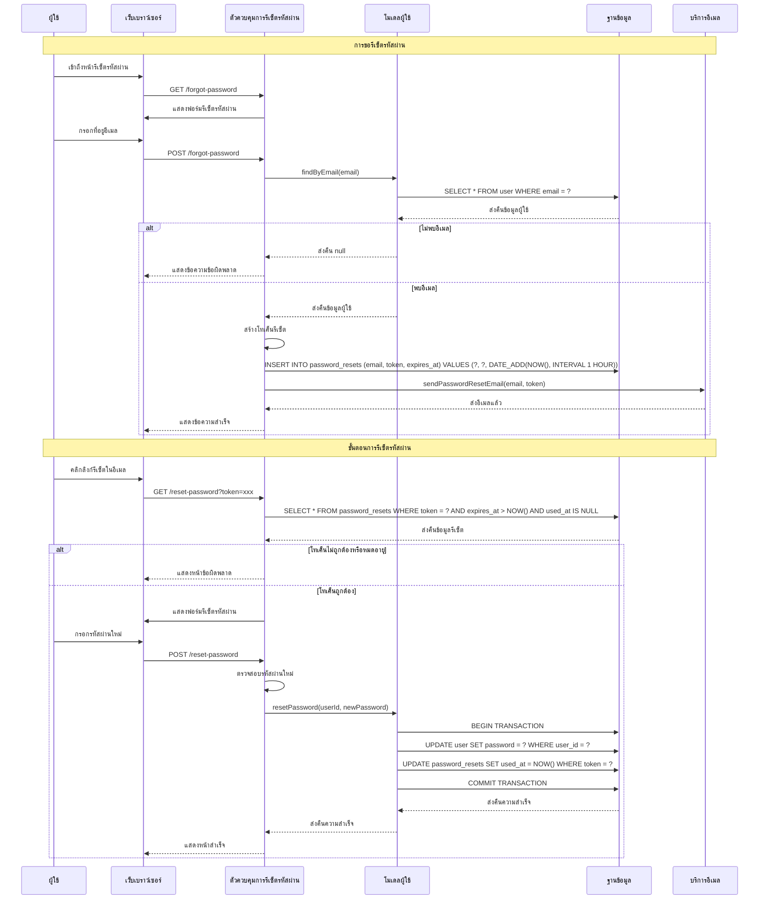

# การรีเซ็ตรหัสผ่าน - ระบบจัดการคลินิกทันตกรรม

```mermaid
sequenceDiagram
    participant U as ผู้ใช้
    participant W as เว็บเบราว์เซอร์
    participant PRC as ตัวควบคุมการรีเซ็ตรหัสผ่าน
    participant UM as โมเดลผู้ใช้
    participant DB as ฐานข้อมูล
    participant ES as บริการอีเมล

    Note over U,ES: การขอรีเซ็ตรหัสผ่าน
    U->>W: เข้าถึงหน้ารีเซ็ตรหัสผ่าน
    W->>PRC: GET /forgot-password
    PRC->>W: แสดงฟอร์มรีเซ็ตรหัสผ่าน
    U->>W: กรอกที่อยู่อีเมล
    W->>PRC: POST /forgot-password
    PRC->>UM: findByEmail(email)
    UM->>DB: SELECT * FROM user WHERE email = ?
    DB-->>UM: ส่งคืนข้อมูลผู้ใช้
    alt ไม่พบอีเมล
        UM-->>PRC: ส่งคืน null
        PRC-->>W: แสดงข้อความข้อผิดพลาด
    else พบอีเมล
        UM-->>PRC: ส่งคืนข้อมูลผู้ใช้
        PRC->>PRC: สร้างโทเค็นรีเซ็ต
        PRC->>DB: INSERT INTO password_resets (email, token, expires_at) VALUES (?, ?, DATE_ADD(NOW(), INTERVAL 1 HOUR))
        PRC->>ES: sendPasswordResetEmail(email, token)
        ES-->>PRC: ส่งอีเมลแล้ว
        PRC-->>W: แสดงข้อความสำเร็จ
    end

    Note over U,ES: ขั้นตอนการรีเซ็ตรหัสผ่าน
    U->>W: คลิกลิงก์รีเซ็ตในอีเมล
    W->>PRC: GET /reset-password?token=xxx
    PRC->>DB: SELECT * FROM password_resets WHERE token = ? AND expires_at > NOW() AND used_at IS NULL
    DB-->>PRC: ส่งคืนข้อมูลรีเซ็ต
    alt โทเค็นไม่ถูกต้องหรือหมดอายุ
        PRC-->>W: แสดงหน้าข้อผิดพลาด
    else โทเค็นถูกต้อง
        PRC->>W: แสดงฟอร์มรีเซ็ตรหัสผ่าน
        U->>W: กรอกรหัสผ่านใหม่
        W->>PRC: POST /reset-password
        PRC->>PRC: ตรวจสอบรหัสผ่านใหม่
        PRC->>UM: resetPassword(userId, newPassword)
        UM->>DB: BEGIN TRANSACTION
        UM->>DB: UPDATE user SET password = ? WHERE user_id = ?
        UM->>DB: UPDATE password_resets SET used_at = NOW() WHERE token = ?
        UM->>DB: COMMIT TRANSACTION
        DB-->>UM: ส่งคืนความสำเร็จ
        UM-->>PRC: ส่งคืนความสำเร็จ
        PRC-->>W: แสดงหน้าสำเร็จ
    end
```