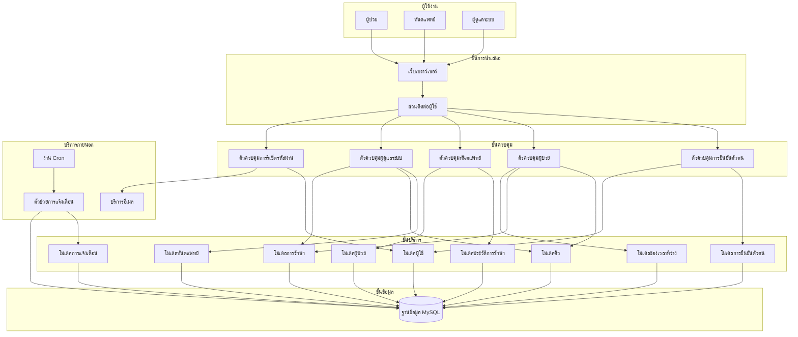
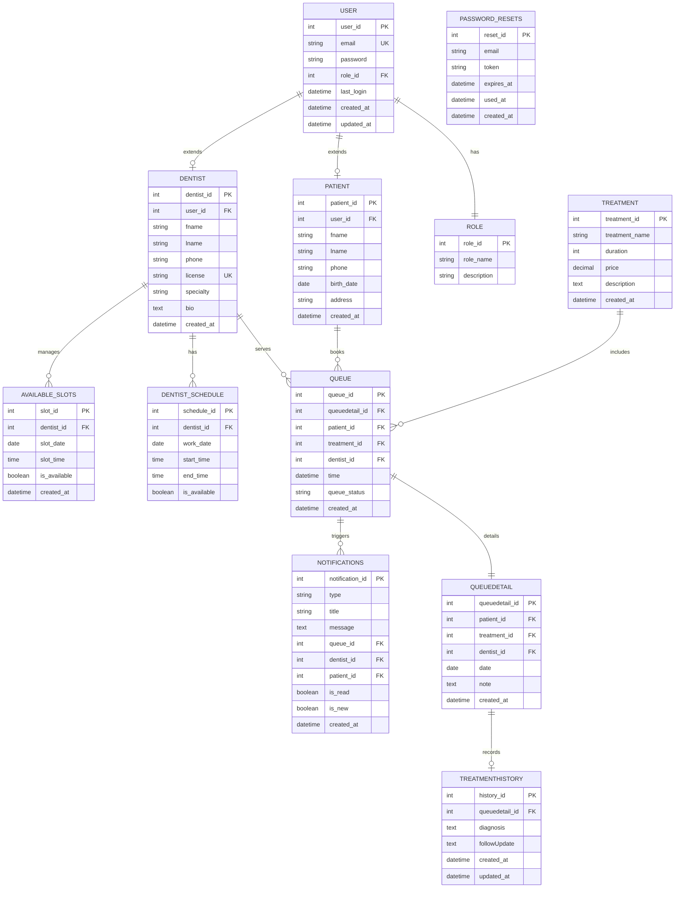
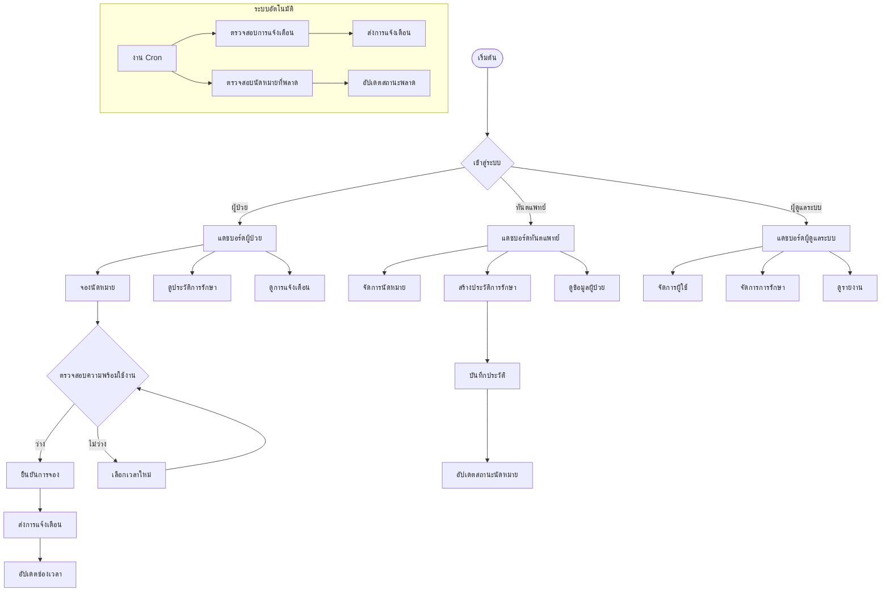

# ภาพรวมระบบ - ระบบจัดการคลินิกทันตกรรม

## สถาปัตยกรรมระบบ

```mermaid
graph TB
    subgraph "ผู้ใช้งาน"
        P[ผู้ป่วย]
        D[ทันตแพทย์]
        A[ผู้ดูแลระบบ]
    end

    subgraph "ชั้นการนำเสนอ"
        W[เว็บเบราว์เซอร์]
        UI[ส่วนติดต่อผู้ใช้]
    end

    subgraph "ชั้นควบคุม"
        AC[ตัวควบคุมการยืนยันตัวตน]
        PC[ตัวควบคุมผู้ป่วย]
        DC[ตัวควบคุมทันตแพทย์]
        ADC[ตัวควบคุมผู้ดูแลระบบ]
        PRC[ตัวควบคุมการรีเซ็ตรหัสผ่าน]
    end

    subgraph "ชั้นบริการ"
        AM[โมเดลการยืนยันตัวตน]
        UM[โมเดลผู้ใช้]
        PM[โมเดลผู้ป่วย]
        DM[โมเดลทันตแพทย์]
        QM[โมเดลคิว]
        TM[โมเดลการรักษา]
        THM[โมเดลประวัติการรักษา]
        NM[โมเดลการแจ้งเตือน]
        ASM[โมเดลช่องเวลาที่ว่าง]
    end

    subgraph "ชั้นข้อมูล"
        DB[(ฐานข้อมูล MySQL)]
    end

    subgraph "บริการภายนอก"
        ES[บริการอีเมล]
        CJ[งาน Cron]
        NH[ตัวช่วยการแจ้งเตือน]
    end

    P --> W
    D --> W
    A --> W
    W --> UI
    UI --> AC
    UI --> PC
    UI --> DC
    UI --> ADC
    UI --> PRC

    AC --> AM
    AC --> UM
    PC --> QM
    PC --> TM
    PC --> ASM
    DC --> THM
    DC --> PM
    ADC --> DM
    ADC --> QM
    ADC --> TM
    PRC --> UM

    AM --> DB
    UM --> DB
    PM --> DB
    DM --> DB
    QM --> DB
    TM --> DB
    THM --> DB
    NM --> DB
    ASM --> DB

    PRC --> ES
    CJ --> NH
    NH --> NM
    NH --> DB
```

## โครงสร้างฐานข้อมูล

```mermaid
erDiagram
    USER {
        int user_id PK
        string email UK
        string password
        int role_id FK
        datetime last_login
        datetime created_at
        datetime updated_at
    }

    ROLE {
        int role_id PK
        string role_name
        string description
    }

    PATIENT {
        int patient_id PK
        int user_id FK
        string fname
        string lname
        string phone
        date birth_date
        string address
        datetime created_at
    }

    DENTIST {
        int dentist_id PK
        int user_id FK
        string fname
        string lname
        string phone
        string license UK
        string specialty
        text bio
        datetime created_at
    }

    TREATMENT {
        int treatment_id PK
        string treatment_name
        int duration
        decimal price
        text description
        datetime created_at
    }

    QUEUE {
        int queue_id PK
        int queuedetail_id FK
        int patient_id FK
        int treatment_id FK
        int dentist_id FK
        datetime time
        string queue_status
        datetime created_at
    }

    QUEUEDETAIL {
        int queuedetail_id PK
        int patient_id FK
        int treatment_id FK
        int dentist_id FK
        date date
        text note
        datetime created_at
    }

    TREATMENTHISTORY {
        int history_id PK
        int queuedetail_id FK
        text diagnosis
        text followUpdate
        datetime created_at
        datetime updated_at
    }

    NOTIFICATIONS {
        int notification_id PK
        string type
        string title
        text message
        int queue_id FK
        int dentist_id FK
        int patient_id FK
        boolean is_read
        boolean is_new
        datetime created_at
    }

    DENTIST_SCHEDULE {
        int schedule_id PK
        int dentist_id FK
        date work_date
        time start_time
        time end_time
        boolean is_available
    }

    AVAILABLE_SLOTS {
        int slot_id PK
        int dentist_id FK
        date slot_date
        time slot_time
        boolean is_available
        datetime created_at
    }

    PASSWORD_RESETS {
        int reset_id PK
        string email
        string token
        datetime expires_at
        datetime used_at
        datetime created_at
    }

    USER ||--|| ROLE : has
    USER ||--o| PATIENT : extends
    USER ||--o| DENTIST : extends
    PATIENT ||--o{ QUEUE : books
    DENTIST ||--o{ QUEUE : serves
    TREATMENT ||--o{ QUEUE : includes
    QUEUE ||--|| QUEUEDETAIL : details
    QUEUEDETAIL ||--o| TREATMENTHISTORY : records
    QUEUE ||--o{ NOTIFICATIONS : triggers
    DENTIST ||--o{ DENTIST_SCHEDULE : has
    DENTIST ||--o{ AVAILABLE_SLOTS : manages
```

## ขั้นตอนการทำงานหลัก

```mermaid
flowchart TD
    Start([เริ่มต้น]) --> Login{เข้าสู่ระบบ}
    Login -->|ผู้ป่วย| PatientDash[แดชบอร์ดผู้ป่วย]
    Login -->|ทันตแพทย์| DentistDash[แดชบอร์ดทันตแพทย์]
    Login -->|ผู้ดูแลระบบ| AdminDash[แดชบอร์ดผู้ดูแลระบบ]

    PatientDash --> BookAppt[จองนัดหมาย]
    PatientDash --> ViewHistory[ดูประวัติการรักษา]
    PatientDash --> ViewNotif[ดูการแจ้งเตือน]

    DentistDash --> ManageAppt[จัดการนัดหมาย]
    DentistDash --> CreateHistory[สร้างประวัติการรักษา]
    DentistDash --> ViewPatients[ดูข้อมูลผู้ป่วย]

    AdminDash --> ManageUsers[จัดการผู้ใช้]
    AdminDash --> ManageTreatments[จัดการการรักษา]
    AdminDash --> ViewReports[ดูรายงาน]

    BookAppt --> CheckAvailability{ตรวจสอบความพร้อมใช้งาน}
    CheckAvailability -->|ว่าง| ConfirmBooking[ยืนยันการจอง]
    CheckAvailability -->|ไม่ว่าง| SelectNewTime[เลือกเวลาใหม่]
    SelectNewTime --> CheckAvailability

    ConfirmBooking --> SendNotification[ส่งการแจ้งเตือน]
    SendNotification --> UpdateSlots[อัปเดตช่องเวลา]

    CreateHistory --> SaveRecord[บันทึกประวัติ]
    SaveRecord --> UpdateStatus[อัปเดตสถานะนัดหมาย]

    subgraph "ระบบอัตโนมัติ"
        CronJob[งาน Cron] --> CheckReminders[ตรวจสอบการแจ้งเตือน]
        CheckReminders --> SendReminders[ส่งการแจ้งเตือน]
        CronJob --> CheckMissed[ตรวจสอบนัดหมายที่พลาด]
        CheckMissed --> UpdateMissed[อัปเดตสถานะพลาด]
    end
```